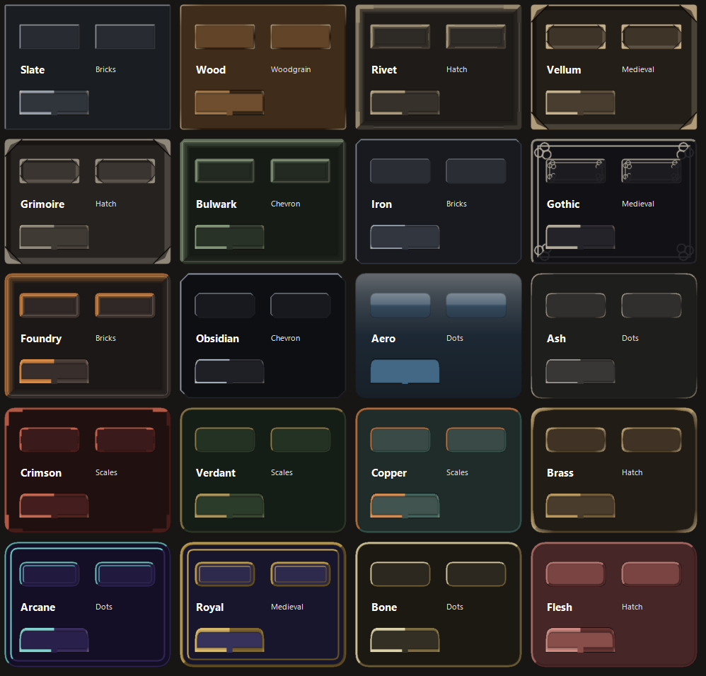
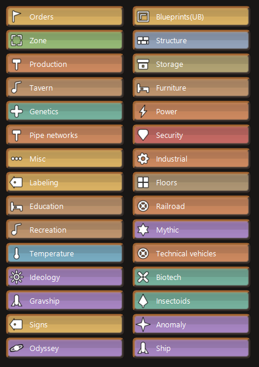

# Lizarb Interface

A complete reskin of RimWorld 1.6's interface: window frames, buttons, tabs, tooltips,
widgets, scrollbars, fonts and the Architect menu.





## What it does

- **Presets.** A preset is the whole look in one click: a texture set, a typeface and its
  sizes, the text outline, the background pattern and its strength, and how the Architect
  menu is coloured. Two presets can share one texture set and read completely differently,
  which is how PixelStone and PixelStone Fake are the same pixels with different type.
- **Themes**, hand painted or Legacy, are the texture sets a preset draws with. Each changes
  palette, corner radius, fillet weight, corner ornament and background pattern. Iron is
  square and austere, Royal is wide and heavy, Aero is a translucent bubble with no
  outline at all.
- **Tileable background patterns**, baked per theme so they carry the theme's own inks.
- **Fonts.** Every face ships inside an AssetBundle, so they are there with nothing
  to install; any font already on the machine can be picked as well. Three text sizes
  are adjustable, and every label can carry a real outline at a chosen opacity.
- **Architect colours.** Every category button is coloured by what the category is for.
  Colours come from twelve families rather than the whole hue circle, and categories doing
  related jobs share one on purpose, and that similarity is what keeps thirty buttons from
  reading as noise. Categories added by other mods are matched on their name, so Storage
  lands with storage and Genetics with the medical group, with no patch on their side.
  The colour is drawn through a 9-slice, so it follows the theme corner radius: fill the
  button, a stripe down one edge, a border, or a flat rectangle.
- **Icons.** An optional set this mod draws itself, white with a black outline, covering
  the Architect categories, the play settings row, search and codex, and the game speed
  controls. Icons that belong to other mods are never replaced.
- **Spacing.** Paints each element slightly inside its own rect, so neighbouring buttons
  stop touching. No layout number is changed, so nothing moves.

## Install

Requires [Harmony](https://steamcommunity.com/sharedfiles/filedetails/?id=2009463077).

Clone into RimWorld's `Mods` folder. The repository root **is** the mod folder:

```
git clone https://github.com/dequevedo/lizarb-interface "RimWorld/Mods/LizarbInterface"
```

Load it last if you want its look to win over other UI mods.

## Settings

Six tabs: **Theme**, **Text**, **Surfaces**, **Windows**, **Architect**, **Components**.

The Components tab is the compatibility valve. Buttons, window frames, tabs, widgets and
scrollbars can each be handed back to the game independently, so one clash with another UI
mod does not cost you the whole skin.

## Compatibility

The mod logs every other mod that patches a method it also patches:

```
[LizarbInterface] patch audit: 1 method(s) also patched by other mods.
  TabRecord.Draw  <-  some.other.mod (prefix)
```

A transpiler alongside our prefix composes fine. Another **prefix** on `TabRecord.Draw`,
`DrawWindowBackground` or `DrawMenuSection` is the one to watch, since those are replaced
outright. This mod deliberately carries no Harmony priority on them, so it yields,
losing its own styling rather than breaking someone else's feature.

## Building

```
dotnet build -c Release Source/LizarbInterface/LizarbInterface.csproj
```

References come from NuGet (`Krafs.Rimworld.Ref`, `Lib.Harmony`); no game DLL is copied
into the repository. Output goes straight to `Assemblies/`.

Everything in `Skins/` is a plain PNG. The skins grouped as Legacy came out of a generator
script that has since been removed; they are kept as files, exactly as it last drew them.

A hand painted theme needs no build step: any folder dropped into `Skins/` with a `ButtonBG.png`
in it is found on its own and appears in the list. Anything it does not draw is filled in
from its own files first and then from a complete theme, so one file is already a theme. A
`theme.txt` beside it names the background pattern, its strength, the pixel density and
whether the edges tile.

A preset that ships with the mod is a `Presets/<file>.txt`. It starts from its theme's own
preset and overrides only what it names, so `Presets/PixelStone Pixel.txt` is six lines: the
same textures with a pixel typeface and no background.

The Architect icons in `Skins/Shared` are ordinary PNGs, and the game loads those files, not
the script. Most come from the Game Icon Pack; the rest were drawn for this mod. `tools/Make-Icons.ps1`
builds them from the masters in `art/icons/`, adding the black outline from the alpha so
hand drawn art does not have to carry one. The same hash guard protects `docs/` and the
textures in `Skins/`: anything whose bytes no longer match what the generator produced is
reported and left alone, and `-Force` overrides that.

`tools/Make-FontBundle.ps1` builds the font AssetBundles. It reads the required Unity
version out of the game's own `globalgamemanagers` rather than hardcoding it, because a
bundle built against the wrong version fails silently. `-Platform win,mac,linux` selects
targets; a target whose Unity build-support module is missing is reported and skipped
rather than failing the run.

## Releasing

The repository root is the mod folder, so a clone into `Mods/` runs as-is. That is
convenient for development and wrong for the Workshop, where `tools/`, `dev/`, `docs/` and
the `.git` directory would all be uploaded along with it.

```
tools/Make-Release.ps1
```

builds the assembly and stages only what ships into `dist/LizarbInterface/`. Two things it
deliberately keeps: `Source/` without `bin` and `obj`, because GPL-3.0 requires the source to
accompany the binary and there is no reason to make anyone chase a link for it; and
`Fonts/OFL-*.txt` without the `.ttf` themselves, because the AssetBundle already carries the
font data and a redistribution has to travel with its licences.

`-Link` points `Mods/LizarbInterface` at the staged folder, and `-Dev` points it back at the
working tree. That pair matters: while the junction points at `dist/`, editing the repository
changes nothing in the game.

`About/PublishedFileId.txt` is what ties a folder to its Workshop item. The script carries
an existing one across rebuilds, but after the first upload it has to be copied back into
the repository, or the next release publishes a second item instead of updating the first.

## Licence

Copyright (C) 2026 Lizarb.

Code and textures are GPL-3.0 (see `LICENSE`). The complete source is in `Source/`, and it
ships alongside the compiled assembly so the binary is never distributed without it.

The fonts are **not**. Each is under the SIL Open Font License, with its own licence
file beside it in `Fonts/`. They are redistributed under those terms, both as the `.ttf`
sources in `Fonts/` and inside the font AssetBundle.

`Fonts/` is the input to `tools/Make-FontBundle.ps1`; nothing reads it at runtime. The
`.ttf` files are not needed in a release build, but the `OFL-*.txt` beside them are: the
bundle is a redistribution of the fonts, so the licences have to travel with it.

### Font credits

Audiowide, Marcellus and Uncial Antiqua by Brian J. Bonislawsky (Astigmatic).
Electrolize by Cyreal. IM FELL English by Igino Marini. MedievalSharp by wmk69.
Metamorphous by Sorkin Type Co. Quattrocento Sans by Pablo Impallari. Rajdhani by
Indian Type Foundry. Russo One by Jovanny Lemonad.

Alegreya, Amaranth, Black Ops One, Bungee, Chakra Petch, Cinzel, Cormorant Garamond,
EB Garamond, Exo 2, Grenze Gotisch, Jacquard 24, Jersey 10, Michroma, Orbitron,
Philosopher, Pixelify Sans, Saira Stencil One, Spectral, Teko, Vollkorn and Zen Dots are
credited to their project authors, named in each licence file.

### Icon credits

The interface icons come from the Game Icon Pack v1.4 by Nieobie, released under
CC0 1.0 Universal.

Every icon has one 512px master and only one. `art/icons/pack/` holds the forty
four that came from the pack, `art/icons/custom/` the nine drawn for this mod,
and `tools/Make-Icons.ps1` builds both into `Skins/Shared/`. Neither folder
ships: only the built icons do.


## Built with AI

The code was written with Claude, Anthropic's assistant, with me directing, testing
and deciding.

No image AI was involved in the art. The skins grouped as Legacy were drawn by a script
from geometry: signed distance fields, analytic coverage for the anti-aliasing, and a
palette per theme. The hand painted ones are drawn by me.
